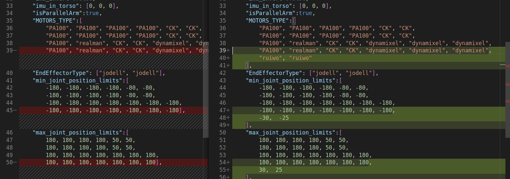

# 基本使用

## 使用示例代码

### 获取代码

1. Clone 代码：git clone https://gitee.com/leju-robot/kuavo_opensource 

### 确认环境变量中的机器人版本
- 我们的 Kuavo 实物机器人包含多个型号, 程序已经适配不同版本, 只需要在环境变量里面设置机器人版本即可。
- 确认机器人版本，在终端输入`echo $ROBOT_VERSION`, 输出版本号*10 的整数, 如 Kuavo2.3 版本即为 23，Kuavo3.2 版本即为 32 以此类推。
- 如果没有设置机器人版本, 或者版本号和自己的机器人版本不对应，则根据以下流程设置。

        1. 根据使用的终端类型, 选择对应的配置文件。如 bash 终端, 编辑`~/.bashrc`；
        2. 添加`export ROBOT_VERSION=23`(Kuavo2.3 版本即为 23，Kuavo3.2 版本即为 32 以此类推)到文件末尾, 保存并退出。
        3. 重新打开终端或者`source ~/.bashrc`, 重新编译代码即可生效。

### 配置文件
- 与 kuavo 相关的配置文件在 `$HOME/.config/lejuconfig/config/config/kuavo_v*`目录下, 其中 `*` 为机器人版本号，
- 与 kuavo 相关的 model 文件在 `$HOME/.config/lejuconfig/models/` 目录下,  
- 程序启动时， 如果配置文件或 model 不存在，则会自动从 src 对应的目录拷贝。
- 如果需要修改配置文件, 请修改`$HOME/.config/lejuconfig/config/kuavo_v*`目录下的配置文件，
- 程序启动时会打印如下配置文件信息，如果修改没有生效，请检查程序实际加载的配置文件与修改的是否一致：
```
[ConfigReader] CURRENT_SOURCE_DIR: /home/carlos/ohh_katkin_ws/src/kuavo
[ConfigReader] CONFIG_ROOT_PATH: /home/lab/.config/lejuconfig
[ConfigReader] CONFIG_PATH: /home/lab/.config/lejuconfig/config/kuavo_v4.0/kuavo.json
```


### 头部关节配置
当机器人存在头部关节时(有时头部可能不存在或是连接线被断开), 如果你需要获取头部关节的位置信息, 那么就需要修改`$HOME/.config/lejuconfig/config/kuavo_v*`目录下的配置文件(v3.4, v4.0...),添加以下内容:
- 修改 MOTORS_TYPE 声明头部电机的类型, 比如 `ruiwo`,
- 修改 min_joint_position_limits 和 max_joint_position_limits 声明头部关节的大小限位.



**如果不需要头部关节信息, 请忽略此步骤.**

### 依赖

当前 kuavo 依赖的开发库如下，编译前需要安装以下依赖:
> libmodbus-dev:amd64 
> 
> libmodbus5:amd64 
>
> libusb-1.0-0-dev
```
sudo apt install libmodbus-dev:amd64 libmodbus5:amd64 libusb-1.0-0-dev
```

### 编译代码

> 编译选项说明：
> 
> USE_PYTHON_RUIWO_SDK
> - ON： 启用ruiwo_controller 启用 Python 版本的 SDK
> - OFF：默认值，启用ruiwo_controller 启用 C++ 版本的 SDK

1. cd kuavo_opensource (如果使用了 git clone https://gitee.com/leju-robot/kuavo_opensource new_dir, 那么这里 cd 应该 cd 到 new_dir)
2. mkdir build 创建 cmake 需要的目录
3. cmake .. 使用 cmake 生成编译文件用的 Makefiles(加上参数 `-DONLY_USE_HALF_UP_BODY=on` 可以编译出只控制上半身的程序，**注意：需要把原来的build 目录中的内容删掉再编译，避免缓存的影响导致无法生效**)
4. make -j$(nproc) 这里是使用当前系统的 cpu 数，作为 make 编译并发的最大线程数
5. 如果编译错误，请使用 git status 查看是否改动过代码或者相关的第三方库
6. 如果编译成功，会在 ./src/biped_v2/kuavoController 产生一个执行文件


### 运行程序

编译仓库代码，会生成几个可执行文件

- ./src/biped_v2/kuavoController  控制程序，可以直接运行，控制机器人运动
- ./src/biped_v2/bin2csv 日志转换程序，将记录的 log 转换为 csv 格式，可在 plotjuggler 等工具中打开
- ./src/biped_v2/drake_play_back  回放程序，可以回放之前的 log

#### 参数说明
`kuavoController`程序包含众多参数，可以通过--help 查看参数用法，常见的比如：

- --real  运行在真实机器人上，实物上需要使用 root 权限运行
- --cali  校准模式(只在实物上使用)，运行校准模式，机器人全身电机回零，用于观察零位是否正确
- --setzero 触发机器人 ruiwo 电机的零位校准，只在实物上使用并且是 `ROS` 模式运行(需要与 `--cali`  参数一起使用)
- --log  开启 lcm 日志记录，默认关闭，开启之后会将每个时刻(精确到 0.1ms)所有状态量记录到一个`lcm_log.bin`中，通过 bin2csv 可以转换为 csv 格式

`bin2csv`程序允许传入需要转换的二进制日志文件的路径，和输出的 csv 文件名。
- 不指定参数时，默认使用最近运行`kuavoController`保存到`/tmp/lcm_log.bin`的日志文件。
- 每次运行所有日志会保存到`/var/lcm_log/`目录下，以时间戳命名。

#### 仿真运行

仿真环境基于 drake 运行, 请参考以下步骤, 如果想用 docker 来运行 Drake, 可以参考 [docs/kuaovo_docker_env.md](docs/kuaovo_docker_env.md)

1. drake-visualizer 启动 drake 的前端环境

2. 执行机器人程序: `sudo ./src/biped_v2/kuavoController`

#### 按键说明:

:speech_balloon: ：*注意是在执行 `kuavoController` 的终端中进行按键操作，且每次按键后需再次按下回车才会生效。*

- 在站立状态下才可以切换到行走、跳跃、下蹲等动作模式
    - 按下 r 键, 进入行走状态
    - 按下 j 键, 进入跳跃状态
    - 按下 p 键, 进入下蹲状态
    - 按下 h 和 k 键, 控制手爪开合(需要实物支持)
    - 按下数字键 1,2,3...7, 执行对应配置文件(`$HOME/.config/lejuconfig/config/<ROBOT_VERSION>/pose_hand_arm.csv`)中的第 n 个动作
    - 按下数字键 8，9 执行对应配置文件(`$HOME/.config/lejuconfig/config/<ROBOT_VERSION>/pose.csv`)中的对应组合动作
- 走路状态下
    - 默认进入行走时是速度控制模式, 机器人进行原地踏步
    - 按 w,a,s,d 控制机器人前后左右移动, 
    - q,e 控制机器人左右旋转
    - 正在移动时, 按空格键, 机器人速度归零
    - 按下 c 键, 退出走路状态, 回到站立状态
- 跳跃状态下
    - 进入跳跃状态，机器人会先缓慢下蹲，等待下蹲到不动时才能进行起跳
    - 按下空格键或者 j 键, 起跳
    - 机器人会自动跳跃、落地，等待机器人站稳，可以再次按下空格键或者 j 键, 起跳
    - 按下 c 键或 q 键, 退出跳跃状态, 回到站立状态
- 其他状态下
    - 按下 c 键或者 q 键, 退出当前状态，回到站立状态
  
#### 实物运行
##### 校正机器人的电机位置

> 由于目前电机的单编码器装在电机高速端，还无法记住关节的绝对位置，所以每次电机断电之后重启，都需要先校准电机位置，让其落于此前记录零点位置时的那一圈里面, 之后就可以正常使用机器人了。

1. 将机器人拉离地面，并将所有的关节掰动的起始的位置，给机器人 NUC 和电机上电
2. 执行 sudo ./src/biped_v2/kuavoController --real --cali ，此时等待 EtherCat 通信自检。如果自检通过，机器人的电机会执行到起始的位置。如果观察到起始的位置不正确，只需要关闭电机总开关，调整每个电机的位置，再上电，保持 NUC 开机。再执行一遍 sudo ./src/biped_v2/kuavoController --real --cali。
4. 持续以上的循环，直到机器人在启动校正程序之后初始位置运动到正常的位置。
5. 校正完成之后机器人的电机会记住当前校正的位置，用户在电机关机之前都可以反复运行控制程序，不需要再次进行校正。
6. 如果确实无法调过上电位置将机器人初始位置校直，必要时可以调过调整机器人零点的方式将机器人状态调整到正确的位置, (注意机器人出厂已经调好零点，除非进行了电机的拆装，正常情况下不需要重新校准零点位置，只需要确保上电时编码器记录的位置在记录零点的那一圈之内即可)。
   - 零点文件位于`~/.config/lejuconfig/offset.csv`中
   - 上电之前，将机器人掰至全身关节伸直，然后上电，执行上述校准程序，程序运行时会打印出各个电机的初始位置，将这些位置写入`~/.config/lejuconfig/offset.csv`中。
   - 零点位置也可以根据实际行走或者站立的情况，手动微调。

##### 使用示例程序

1. 执行 sudo ./src/biped_v2/kuavoController --real

以下是操作方法

 2.1 将机器人吊里地面，机器人垂直伸展之后脚底离地面 2CM 以上

 2.2 输入上面的命令，按下回车。此时机器人会控制所有电机运动到准备状态。机器人的腿会缩起。

 2.3 放下机器人，让机器人缩起之后的校正在距离地面 2CM 左右的地方

 2.4 一人配合戴手套，拉住机器人的躯干，另一人按下 o 键，机器人会进入站立状态。站立的时候机器人会有一个向后倒的趋势，拉住机器人的人稍微用力，帮助机器人保持平衡。机器人平衡之后松手即可。

 2.5 机器人站立之后，按下 r 键，机器人会进入基于速度的步态模式，进入步态之后默认各个方向速度为 0， 使用 a（左）d (右) w(前) d(后) 来改变在 x,y 轴上的速度，来控制机器人前后左右移动。机器人移动的时候吊起机器人的吊架需要同步移动，不能拉扯到机器人。
 
 2.6 退出步态模式为按下 c 键，此时机器人会重置移动速度，并退出步态模式，回复站立。（注意！此时不能直接使用 Ctrl+C 退出程序，否则机器人所有关节突然解除控制会产生比较大的惯性拉坏吊架的钢丝，导致机器人跌倒损坏）
 
 2.7 结束调试，按下 p 键，机器人会缩起双腿，使用吊架放下机器人，直到机器人缩起之后的脚底距离地面 2 CM 左右。 按下 Ctrl+C 退出程序。
 
###### 机器人保持站立的示例程序

源码路径: `src/demos/stand/`
编译之后生成的可执行文件：`dynamic_biped_demo_stand`
可执行文件的使用方法: 在 build 目录下执行 `sudo ./src/demos/stand/dynamic_biped_demo_stand`, 如果是在实物运行需要加 `--real` 的参数，即: `sudo ./src/demos/stand/dynamic_biped_demo_stand --real`

###### 源码说明
```
.
├── CMakeLists.txt
└── src
    ├── main.cc   入口程序
    ├── StandRobot.cc 整体的框架，里面包含了状态估计，运动控制的调用
    ├── StandRobot.h
    ├── StandStateEstimation.cpp 状态故常模块
    ├── StandStateEstimation.h
    ├── StandTrajectory.cc  运动控制模块
    ├── StandTrajectory.h
    ├── StateMachineError.cc 机器人状态机的实现：处理错误的状态
    ├── StateMachineError.h
    ├── StateMachineStand.cc  机器人状态机的实现：处理站立的状态
    └── StateMachineStand.h

```

补充: 在 `StandTrajectory::StandTrajectory` 里面有一个基本的说明，在这个站立的示例程序里面用户可以尝试修改机器人躯干的 Yaw , Pictch 角来观察机器人的变化，可以修改执行距离地面的高度来调整机器人的站立高度。请注意，参数的改动需要先在仿真环境中运行一下，以及运行的时候需要把机器人的保护绳挂在支架上。因为如果修改的数字过大导致逆解失败程序可能会崩溃导致机器人倒地。


##### 手臂舵机零点校正程序（如果重装系统，或者手臂的零点损坏可以按照以下的方法重新校正)

用来标定舵机的工作范围和记录当前的零点。如果运行的时候使用 --record 的参数，就会把最新的信息写入到零点配置文件中。 `~/.config/lejuconfig/servos_positions.ini`
如果不带 --record 参数就只会按照 1000ms 的间隔打印当前的舵机位置和读取到的最大和最小值

#### 执行手腕舵机标定程序

切换到仓库的根目录，比如 kuavo_opnesource。然后运行以下命令

```
sudo ./bin/start_tools.sh ./bin/dynamixel_calibrate_servos  --record
```

1. 把每个舵机都各自左右转动到限位的位置，并在限位的位置停留 2 秒。
2. 把每个舵机都转动到零点位置，停留 2 秒
3. 按 q 键，并回车等待校正程序退出。校正程序退出之后，在 `~/.config/lejuconfig/servos_positions.ini` 会记录每个舵机的零点和有效的运动范围。

2. 添加舵机设备的 udev 规则和自动设置 latency_timer, 只需要在重装系统后添加，出厂的机器人已经添加过。

```
sudo cp 99-usb-servo.rules /etc/udev/rules.d/
sudo udevadm control --reload-rules
sudo udevadm trigger
```

