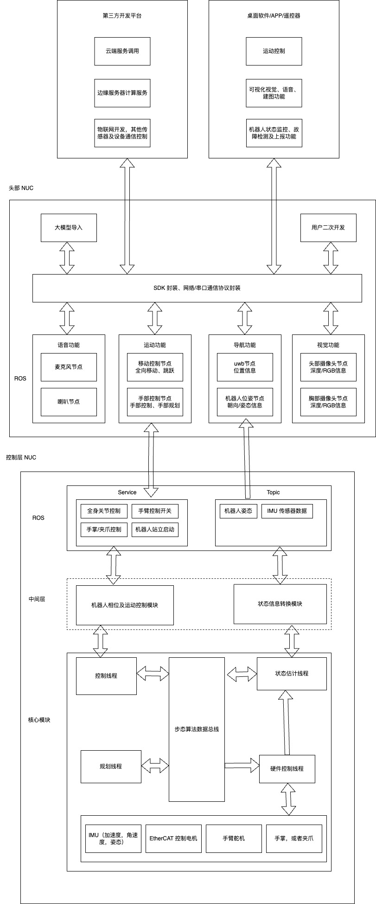

# 代码说明

### 目录结构

```bash
./kuavo_opensource
├── build # 构建目录
│   
├── docs # 文档目录
│   └── ...
├── lcm # lcm 消息定义目录
├── lib # 第三方库目录，以及存放编译出来的库文件
│   ├── DynamixelSDK # Dynamixel SDK
│   ├── EC_Master # EC-Master SDK
│   ├── jodell_claw_driver # 机械爪驱动
│   ├── Math # 常用的数学工具库
│   ├── motioncapture # 动捕 sdk
│   ├── Predict_Fp # MPC 预编译的库
│   ├── ruierman_controller # realman 驱动
│   └── xsens_ros_mti_driver # imu 驱动
│       └── ...
├── models # 模型目录, 包含各个版本的机器人模型的 urdf 文件
│   ├── biped_gen2
│   ├── biped_gen2.3
│   ...
├── ros_package # ros 包目录, 整个 kuavo 仓库可以作为一个 ros 包使用
│   ...
│ 
├── src # 源代码目录
│   ├── biped_v2
│   │   └── config # 配置文件目录， 包含各个版本机器人的配置文件，和 config.h 中定义的宏一致 
│   │       ├── kuavo_v2
│   │       ├── kuavo_v2.3
│   │       ├── kuavo_v3
│   │       ├── kuavo_v3.2
│   │       ├── kuavo_v3.3
│   │       └── kuavo_v3.4
│   ├── common # 公共代码目录，包含公用的一些文件，
│   │   ├── csv_player.h # csvlog 播放，用于回放中从 log 中读取所有状态量
│   │   ├── csv_reader.h # csv 读取器，读取配置文件，csv-log 等
│   │   ├── forceDisturber.h
│   │   ├── FSMStatexxx.h # 状态机相关的定义，记录每个状态下调用的模块，可以根据需要增加状态机
│   │   ├── json.hpp # json 解析库
│   │   ├── kalman_estimate.h # 状态估计中使用的卡尔曼滤波器
│   │   ├── Kalman.h # 卡尔曼滤波器
│   │   ├── lcm_logger.h # 日志库
│   │   ├── lcm_publish.h # log 发布库
│   │   ├── RobotErrorTypes.h # 机器人错误类型定义
│   │   ├── robot_state.h # 机器人状态定义，定义了各个线程之间传递的状态量，需要详细理解
│   │   ├── robotStateStorage.h # 机器人状态存储器，用于存储最近一段时间的机器人状态量，各个线程从这里进行引用调用，用于后续的控制
│   │   ├── robotStateTransform.h # 提供方便的状态坐标转换工具，用于将 robot_state 在不同坐标系之间转换
│   │   ├── sensor_data.h # 传感器数据定义
│   │   ├── sim_sensor.h # 模拟传感器
│   │   ├── traj.h 
│   │   └── utils.h # 一些工具函数，如线程优先级设置函数、时间戳转换和一些常用的函数等
│   ├── controller # 控制器相关代码
│   ├── estimator # 状态估计相关代码
│   ├── hardware # 硬件相关代码
│   ├── planner # 规划相关代码
│   └── opensource # 开源代码
│       ├── biped_v2 # 一些可执行文件
│       │   ├── drake_play_back.cc # log 回放程序
│       │   ├── HighlyDynamicRobot.cc # 机器人主类 HighlyDynamicRobot 的实现
│       │   ├── HighlyDynamicRobot.h # 机器人主类 HighlyDynamicRobot 定义
│       │   ├── logBin2Csv.cc # log 转换程序，将记录的 log 转换为 csv 格式，可在 plotjuggler 等工具中打开
│       │   └── main.cc # 主程序入口
│       └── common
│           ├── config.cpp # 配置文件读取器的定义
│           └── config.h
...
```
## 程序框架

- `HighlyDynamicRobot`类是机器人主类, 封装了机器人最上层的应用接口，包含启动流程、各个模块的初始化、线程管理等
- `src/opensource/biped_v2/HighlyDynamicRobot.h` 可以查看 HighlyDynamicRobot 相关定义和接口
- 软件整体分为几个模块:
  - `hardware` 硬件模块，主要实现是 HardwarePlant 类: 封装了机器人硬件相关接口, 如读取 imu 等传感器、读写电机等
  - `estimator` 状态估计模块，主要实现是 StateEstimation 类: 封装了机器人状态估计的算法, 使用传感器数据进行状态估计, 输出机器人状态
  - `controller` 控制器模块，主要实现是 WholeBodyController 类: 封装了机器人关节控制相关模块, 包括手臂的 PD 控制、WBC 控制、并联杆的力矩换算控制等
  - `planner` 规划模块，主要实现是 Trajectory 类: 封装了机器人各个状态下的轨迹规划、轨迹跟踪、状态机管理相关内容，同时提供上层的接口
  - `common` 模块: 封装了一些公用的工具, 如配置文件读取、状态机、日志记录等
- 软件架构图
  
  
  
 