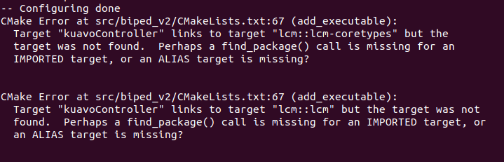
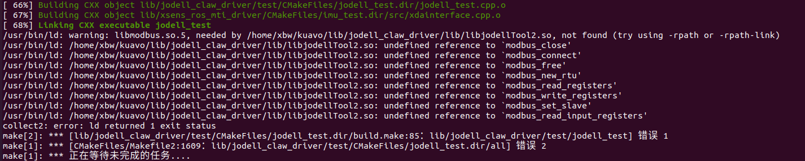
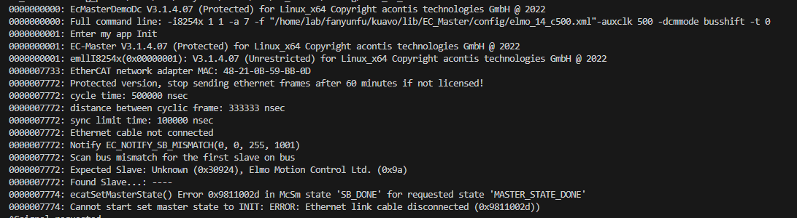
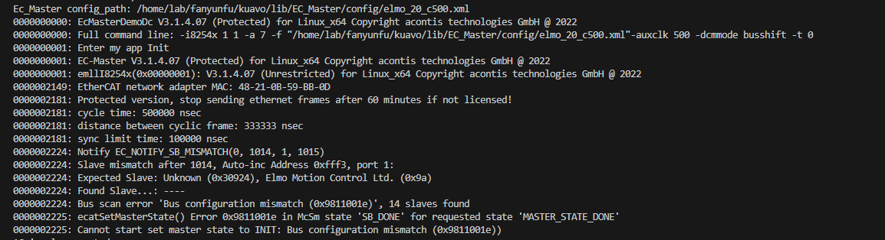
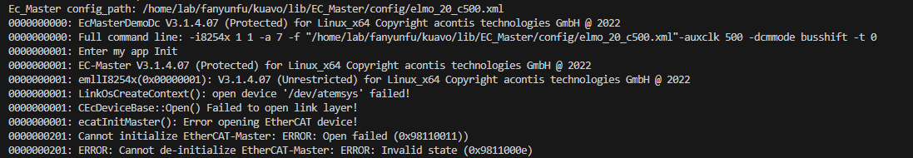
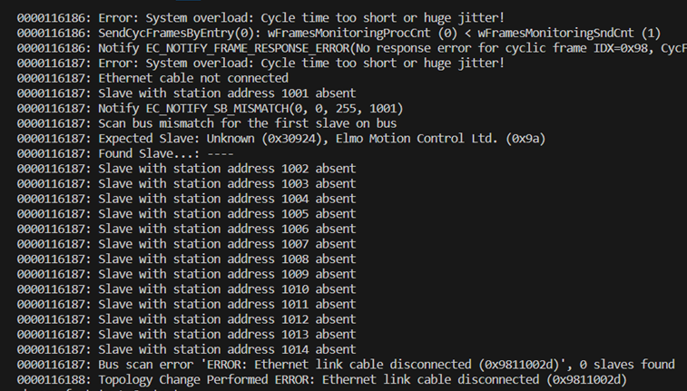
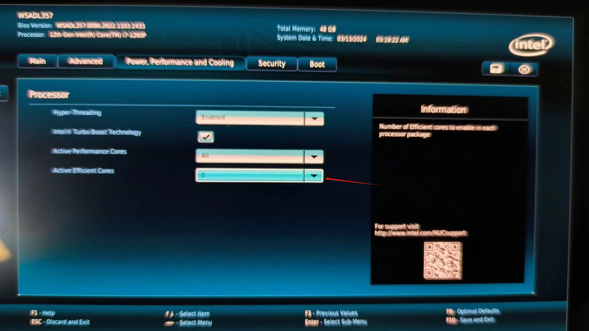

# Q&A

- 重装相关的环境

机器出厂时会安装好相应的开发和运行环境。如果在使用过程中损坏了主机的运行环境有以下两种方法来恢复。注意：请定期，及时保存自己的代码，当环境损坏之后可能之前编辑的代码会丢失。

 1. 使用官方的 Clonezilla 镜像，直接恢复系统到出厂的状态
 2. 使用以下重装环境的方法，重新安装环境

- 安装依赖的相关环境

    1. 安装第三方依赖库 sudo apt-get install liblcm-dev libgflags-dev libgoogle-glog-dev liblmdb-dev ， 如果出现网络问题，可以使用  https://mirrors.tuna.tsinghua.edu.cn/help/ubuntu/ 清华大学的加速源进行替换。

    2. drake

    根据[官方文档](https://drake.mit.edu/apt.html)进行，我们发布的软件版本，需要指定安装 1.19.0-1 版本的 drake。

    ```bash
    # ..先根据官方文档配置好 apt 源
    sudo apt install drake-dev=1.19.0-1
    ```

    > 注意最后一步需要将 drake 安装路径添加到 PATH 环境变量中, 可以根据自己使用的终端类型配置到 ~/.bashrc 或 ~/.zshrc 中。

    3. 安装 mpc 依赖 cassie_alip_mpc 

    参考 https://github.com/UMich-BipedLab/cassie_alip_mpc 中的 Build Install Casadi by Source and Install 章节安装

    3.1 clone: git clone https://github.com/UMich-BipedLab/cassie_alip_mpc.git

    3.2 执行以下命令

    ```bash 
    cd external_packages/casadi

    sudo apt-get install gcc g++ gfortran git cmake liblapack-dev pkg-config --install-recommends

    mkdir build
    cd build

    cmake ..

    sudo make install

    ```

- 编译报错找不到lcm, findpackage()不能找到

    原因:可能是lcm库没有正确安装

    解决方法:确认已经按照以下流程安装lcm库

    ```shell
    # 安装一些依赖
    sudo apt install build-essential libglib2.0-dev cmake default-jdk python-all-dev liblua5.1-dev golang doxygen

    # 克隆仓库并编译安装
    git clone https://github.com/lcm-proj/lcm.git
    cd lcm/ && mkdir bulid && cd build
    cmake .. && make -j8
    sudo make install

    ```
- 编译报错找不到lcm的某些模块, findpackage()能找到lcm
   
    
    
    错误内容: 
    
    ```
    Target "kuavocontroller" links to target "Lcm：：lcm-coretypes" but the target was not found. Perhaps a find_package（） call is missing for an IMPORTED target, or an ALIAS target is missing？ Target "kuavoController" links to target "lcm：：lcn" but the target was not found. Perhaps a find_package（） call is missing for an IMPORTED target,or an ALIAS target is missing？
    ```

    原因: drake 中也带一个 lcm , 可能是 drake 版本不对, 或者drake环境变量没有配置到终端环境里面

    解决方法:
    1. 确认安装了正确的drake版本 `sudo apt install drake-dev=1.19.0-1`
    2. 确认按照 [官方教程](https://drake.mit.edu/apt.html) 配置环境变量
    注意最后一步, 需要根据自己使用的终端类型(常用的bash或者zsh终端), 将下面内容放到对应的配置文件中, 如bash终端放到`~/.bashrc`, zsh终端放到`~/.zshrc`
    ```shell
    export PATH="/opt/drake/bin${PATH:+:${PATH}}"
    export PYTHONPATH="/opt/drake/lib/python$(python3 -c 'import sys; print("{0}.{1}".format(*sys.version_info))')/site-packages${PYTHONPATH:+:${PYTHONPATH}}"
    ```
    3. 重开一个终端或者source对应配置文件, **清空**kuavo仓库的build目录, 再重新编译即可
   
- 编译时出现找不到libmodbus.so
    - 
    - 需要安装modbus库，`sudo apt install libmodbus-dev`

- imu读取超时较多，或者Ecmaster通讯超时

    - 可能原因：imu松动，电机通讯线松动，电池电量低

    - 解决方法：
        - 检查imu和驱动器连接是否正常(所有指示灯正常)
        - 检查电池电量(左右两个电池都需要在60V以上)

- 启动时报错`Scan bus mismatch for the first slave on bus`之类
    - 
    - 可能原因: 主机和第一个驱动器之间的通信异常
    - 解决方法: 检查网线口的指示灯是否亮起, nuc和第一个驱动器之间的连接无松动
- 启动时报错`Slave mismatch after xxx, Auto-inc Address 0xfff3, port 1`之类
    - 
    - 可能原因: 机器人实际电机数和配置文件中的电机数对不上, 可能是机器人版本不对, 或者驱动器之间连接线掉落导致驱动器数不对
    - 解决方法: 
      - `echo $ROBOT_VERSION `打印检查当前机器人版本, 查看对应的配置文件中的电机数是否和实际一致, 不一致需要设置成正确的版本并重新编译程序
      - 数量一致的话检查报错中第xxx个之后的连接是否正常
- 启动时报错 `LinkOsCreateContext(): open device '/dev/atemsys' failed!` 之类
    - 
    - 可能原因: 内核模块`atemsys`没有正确自动挂载或者无权限访问
    - 解决方法: 
      - 程序和硬件交互必须使用sudo执行, 或者切换到root用户下运行, 否则将无法启动
      - 使用sudo执行仍然报错, 则可能是内核模块异常
        - 检查内核模块是否正确挂载, `lsmod | grep atemsys`
        - 如果没有成功挂载, 则使用`sudo modprobe atemsys`尝试手动挂载
        - 如果仍然报错, 则检查内核版本是否正确, `uname -r`, 正常应该是`5.15.94-rt59`, 如果不是则需要开机进入grub页面切换到这个版本的内核
        - 如果grub列表中已经没有对应版本的内核(我们提供的指定内核的镜像才有这个内核模块), 请重新刷写nuc镜像, 或者联系售后人员重新提供内核模块进行安装
  
- 运行时或者电机使能时报错，终端报错 xxx 电机 absent

    - 

    - 可能原因：中间某两个驱动器之间的连接异常，可能是线束松动或者中间某个驱动器损坏(从几号驱动器开始报错离线则那个驱动器和前一个驱动器之间的连接异常)。

    - 解决方法：检查驱动器之间的连接线是否正常，可以是使能之后摇动一下连接线看连接是否稳定 

- 机器人反馈较弱, 查看log超时(1ms)很多
    - 需要注意 12 代的NUC需要禁用掉所有E核, 否则会导致NUC性能降低, 影响计算时间(出厂时的nuc应该预先配置禁用E核)
    - 通过htop确认, 12代的nuc正常禁用掉E核之后, 会只有8个核心, 如果没有禁用, 会有16个核心, 这时候需要进入bios设置
    - 
