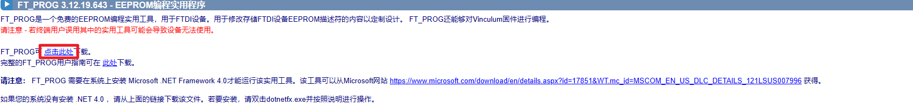
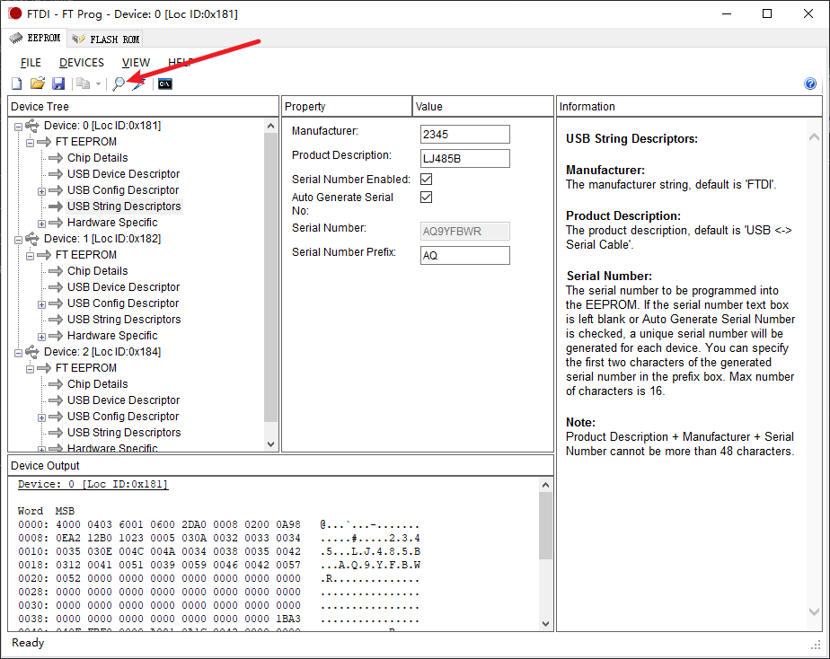
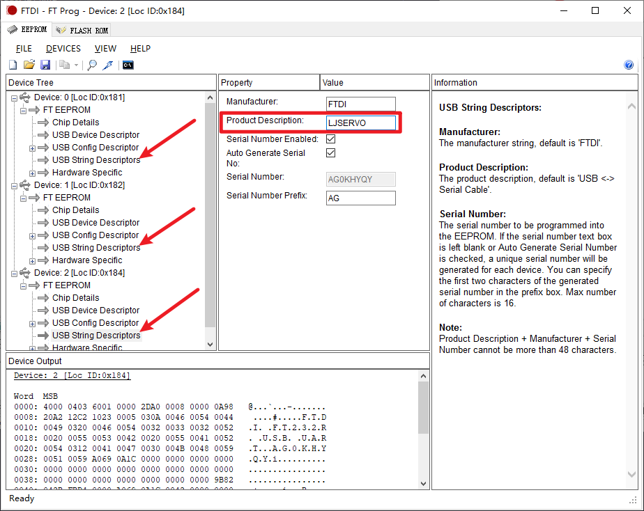
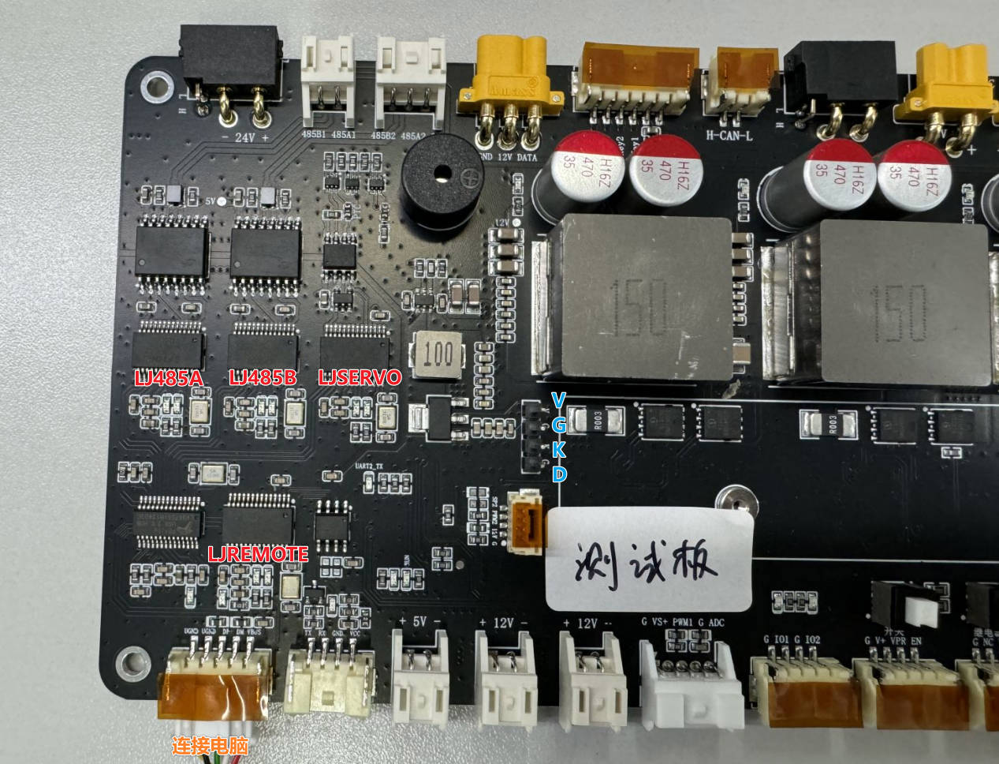
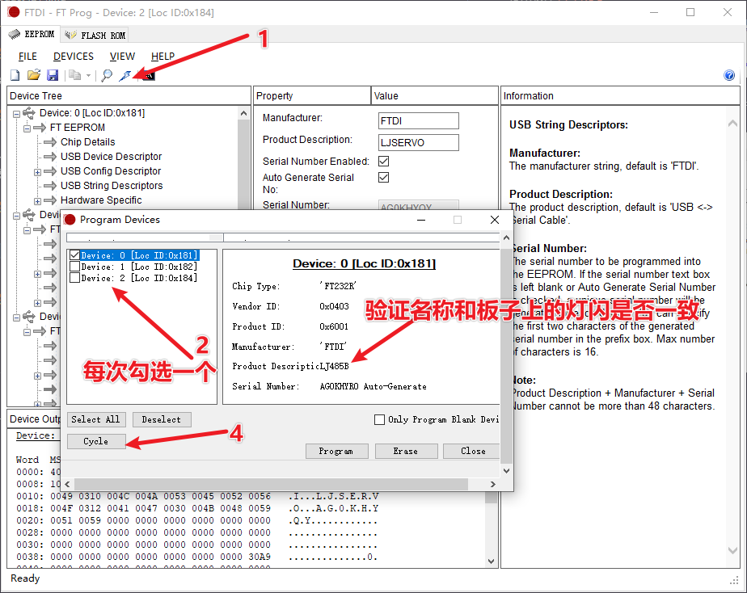
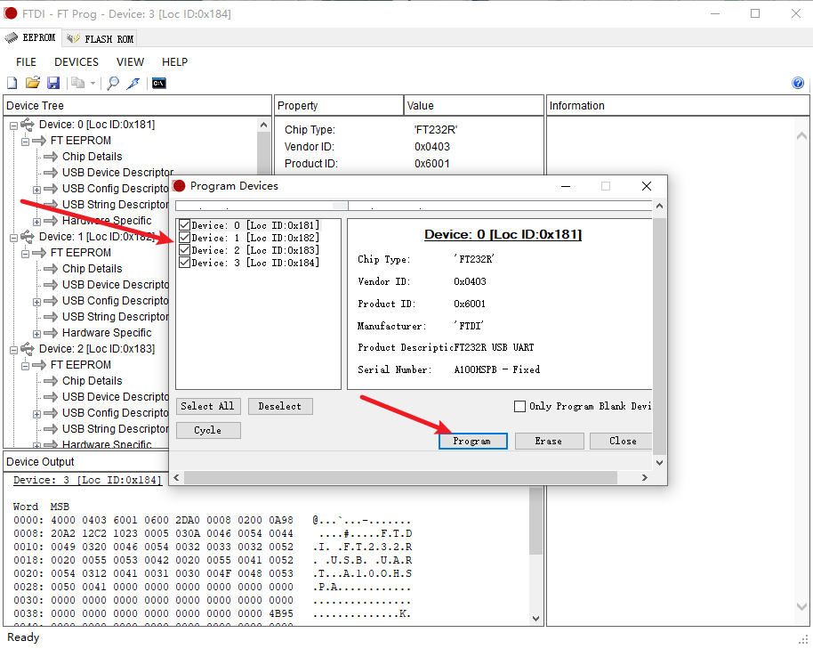
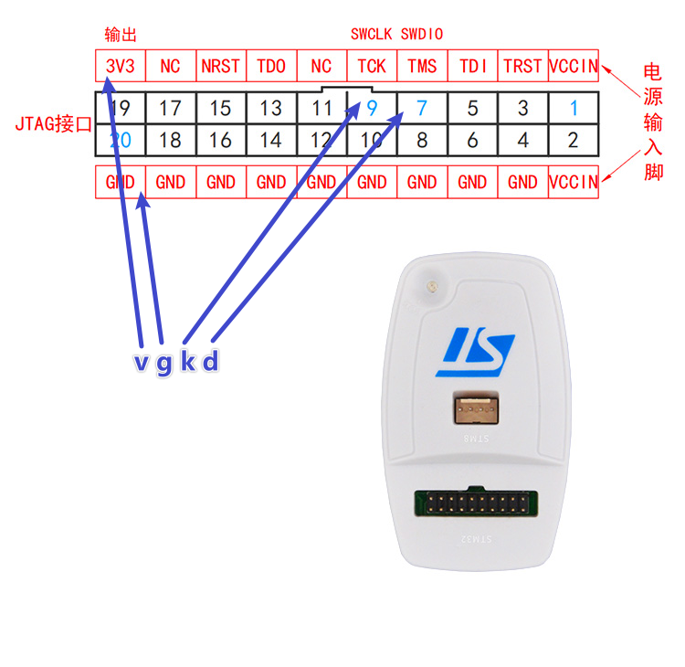
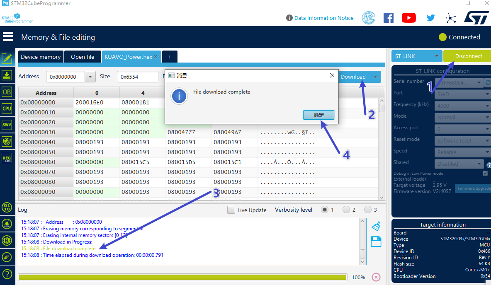

<!--
 * @Author: dongdongmingming
 * @Date: 2024-04-12 16:09:32
 * @LastEditors: Please set LastEditors
 * @LastEditTime: 2024-06-14 15:56:04
 * @FilePath: \kuavo\doc\kuavo_power 烧录 串口product 设置.md
 * @Description: 
-->

# KUAVO_Power V2.1  电源板串口product配置

使用软件 [FT_PROG](https://www.ftdichip.cn/Support/Utilities.htm#FT_PROG)

软件安装后，将 电源板 usb 连接电脑，打开软件，电机扫描，会出现三个设备（如果失败，重新扫描）

三个设备的 Product Description 都要修改，分别修改为 LJSERVO LJ485A LJ485B (顺序对应电源板三个串口); 注意 新版本 板子 有四个需要修改对应下图。

验证顺序,如下图，每次勾选一个 设备，点击 Cycle 一次 相应的灯会闪烁（不要点太快，灯不亮，过2秒再点）。确认 Product Description 和要求的一致。如果不一致，返回重新修改再执行此步骤。 注意 新版本 板子 有四个需要修改对应下图。

确认 Product Description 三个设置都正确后，勾选三个，点击 Program；注意 新版本 板子 有四个需要修改对应下图。

成功后，拔插usb，重新读一遍，确认一下。

# KUAVO_Power V2.1  电源板程序烧录

安装 [SetupSTM32CubeProgrammer-2.14.0](https://www.st.com.cn/zh/development-tools/stm32cubeprog.html)  软件

按照下图所示，连接 vgkd 

使用软件，打开 hex 文件，然后按步骤烧录 ， KUAVO_Power_V2.3  需烧录 KUAVO_Power_20240627.hex  或其之后的固件， 之前的PCB也可以使用该固件 

