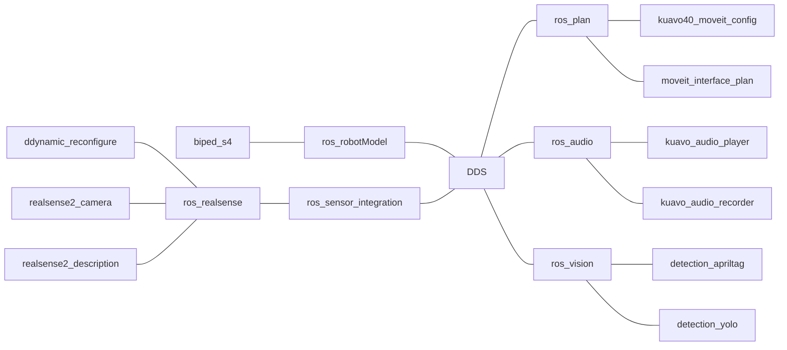

# kuavo_ros_application

## 基础信息

* 用户名：kuavo
* 密码：leju_kuavo
* Ubuntu 版本：22.04

```bash
kuavo@kuavo-NUC12WSKi7:~$ lsb_release -a
No LSB modules are available.
Distributor ID:	Ubuntu
Description:	Ubuntu 22.04.3 LTS
Release:	22.04
Codename:	jammy
```

* 系统内核版本：6.2.0-26-generic

```bash
kuavo@kuavo-NUC12WSKi7:~$ uname -r
6.2.0-26-generic
```

## 基础环境功能包讲解

* ros_audio: 音频流集合，包括音频采集、处理、识别和合成等功能。
```markdown
kuavo_audio_player   -- 播放音频功能包
kuavo_audio_recorder -- 录制音频功能包 
```

* ros_sensor_integration:通用传感器基础节点数据流集合。包含realsense相机，以及后续更新的激光雷达等
```markdown
ros_realsense
* ddynamic_reconfigure -- realsense动态参数功能包
* realsense2_camera -- realsense相机功能包
* realsense2_description -- realsense相机模型功能包
```

* ros_robotModel:机器人模型集合，用于存放Kuavo机器人的urdf及mesh碰撞体，可用于规划仿真或者导航仿真
```markdown
biped_s4 -- Kuavo4代机器人模型功能包
```

* ros_vision:视觉功能集合，用于处理视觉数据的节点和工具。这可能包括对象检测、识别、姿态估计和图像处理等功能的实现。
```markdown
detection_apriltag 
* 里面包含了AprilTag的识别 
* 将目标转换至机器人世界坐标系

detection_yolo     
* 里面包含了yolov5的识别推理 
* 将目标转换至机器人世界坐标系
* 将识别出来的目标的进行点云分割（包含基于Boundingbox的分割 和 SegmentMask像素区域分割）
```

* ros_plan:机器人手臂规划集合，用于通过接收外部的poseStamped，对机器人的抓取姿态进行轨迹规划
```markdown
kuavo40_moveit_config
* 根据kuavo4代机器人配置的ROS启动功能包

moveit_interface_plan
* 包含了基于moveit服务的模式调用设计
* moveit规划两种方式 关节正解joint规划 | 末端pose规划
```

## 快速构建 & 快速启动
### (1) glone & build your workspace
```bash
git clone https://www.lejuhub.com/ros-application-team/kuavo_ros_application.git   # Clone Apriltag library
cd ~/kuavo_ros_application
git checkout ros1_main     # 切换为ros1_main分支
source /opt/ros/noetic/setup.bash

catkin build apriltag_ros  # 优先编译apriltag_ros
catkin build               # 之前所有功能包进行编译
```
### (2) Launch启动传感器感知节点(一键启动launch所有功能)
```bash
cd ~/kuavo_ros_application
source /opt/ros/noetic/setup.bash
source ~/kuavo_ros_application/devel_isolated/setup.bash 

roslaunch dynamic_biped sensor_robot_enable.launch 
```

### (3) `根据个人对于上位机的使用需求，启动不同的demo的launch文件，具体可查看docs/How_to_use_demo的上位机案例`

## 环境配置

* 原始镜像如果不包含 ssh 服务的话则无法远程登录，需要安装 ssh 服务

可以使用下面的命令查看 ssh 服务是否已经安装

```bash
dpkg -l | grep openssh-server
```

如果系统已经安装了 ssh 服务，将会显示与 openssh-server 相关的信息。

```bash
kuavo@kuavo-NUC12WSKi7:~$ dpkg -l | grep openssh-server
ii  openssh-server                             1:8.9p1-3ubuntu0.5                  amd64        secure shell (SSH) server, for secure access from remote machines
```

如果没有显示任何输出或者输出中没有 openssh-server 相关的信息，则表示 SSH 服务尚未安装，可以通过下面的命令进行安装

```bash
sudo apt update
sudo apt install openssh-server
```

安装成功后可以通过 ssh 命令远程登录到系统中

* 从 Ubuntu 18.04 开始，net-tools（包含 ifconfig、netstat 等命令）不再是默认安装的软件包，而是被 iproute2 取代

如果想要使用 ifconfig 等命令需要执行下列命令进行安装

```bash
sudo apt install net-tools
```

使用 iproute2 中的 ip 命令查询当前的 ip 地址等信息

```bash
ip addr show
```

## 开发环境配置  
### 安装ros2  
* C++ 版本：11.4.0
* Python 版本：3.10.12
* ROS2 版本：Humble Hawksbill，官方文档链接：https://docs.ros.org/en/humble/

安装步骤参考链接：https://docs.ros.org/en/humble/Installation/Ubuntu-Install-Debians.html

每次运行前需要执行 source 指令设置环境，执行下列指令将 source 指令添加到 bash 配置文件中，方便后续使用

```bash
echo "source /opt/ros/humble/setup.bash" >> ~/.bashrc
```

安装完成后启动两个终端进行测试，在第一个终端启动 C++ talker

```bash
kuavo@kuavo-NUC12WSKi7:~$ ros2 run demo_nodes_cpp talker
[INFO] [1699249788.302062448] [talker]: Publishing: 'Hello World: 1'
[INFO] [1699249789.302019353] [talker]: Publishing: 'Hello World: 2'
[INFO] [1699249790.302039400] [talker]: Publishing: 'Hello World: 3'
[INFO] [1699249791.302076056] [talker]: Publishing: 'Hello World: 4'
[INFO] [1699249792.302078688] [talker]: Publishing: 'Hello World: 5'
[INFO] [1699249793.302099463] [talker]: Publishing: 'Hello World: 6'
[INFO] [1699249794.302084377] [talker]: Publishing: 'Hello World: 7'
[INFO] [1699249795.302111023] [talker]: Publishing: 'Hello World: 8'
[INFO] [1699249796.302129680] [talker]: Publishing: 'Hello World: 9'
```

在另一个终端启动 Python listener

```bash
kuavo@kuavo-NUC12WSKi7:~$ ros2 run demo_nodes_py listener
[INFO] [1699249818.312333211] [listener]: I heard: [Hello World: 31]
[INFO] [1699249819.305027003] [listener]: I heard: [Hello World: 32]
[INFO] [1699249820.304173906] [listener]: I heard: [Hello World: 33]
[INFO] [1699249821.304101842] [listener]: I heard: [Hello World: 34]
[INFO] [1699249822.304557827] [listener]: I heard: [Hello World: 35]
[INFO] [1699249823.304052685] [listener]: I heard: [Hello World: 36]
[INFO] [1699249824.304549274] [listener]: I heard: [Hello World: 37]
```

### 安装 rqt（在 ROS 2 中，rqt 是一个图形化工具框架，用于可视化和调试 ROS 2 系统。它提供了一系列的插件和界面，使用户能够以图形化的方式监视和控制 ROS 2 的各个方面）  

```bash
sudo apt update
sudo apt install ~nros-humble-rqt*
```

### 安装 colcon 工具（ROS 2中用于构建和管理软件包的工具）  

```bash
sudo apt install python3-colcon-common-extensions
```

### 安装librealsense SDK  
1.添加公钥：  
```bash
sudo mkdir -p /etc/apt/keyrings
curl -sSf https://librealsense.intel.com/Debian/librealsense.pgp | sudo tee /etc/apt/keyrings/librealsense.pgp > /dev/null
```

2.安装HTTPS支持：
```bash
sudo apt-get install apt-transport-https
```

3.将服务器添加到存储库列表
```bash
echo "deb [signed-by=/etc/apt/keyrings/librealsense.pgp] https://librealsense.intel.com/Debian/apt-repo `lsb_release -cs` main" | \
sudo tee /etc/apt/sources.list.d/librealsense.list
sudo apt-get update
```

4.安装库文件
```bash
sudo apt-get install ros-noetic-realsense2-camera
sudo apt-get install librealsense2-utils
```

### 源码编译 -- ros1 noetic
* 机器内部 ubuntu22.04 搭载了ros1 noetic源码编译好的环境，但是使用的时候需要激活一下
* 如果需要使用ros1环境，直接终端输入`sros1` 或者 `source ~/ros_catkin_ws/install_isolated/local_setup.bash` 即可以激活ros1环境
```bash
alias sros1='source ~/ros_catkin_ws/install_isolated/local_setup.bash'
```