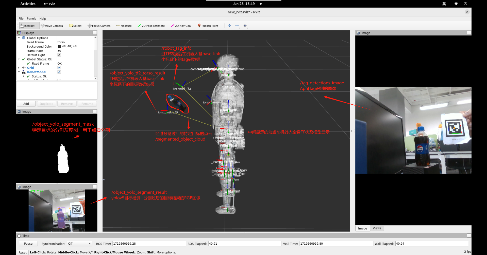
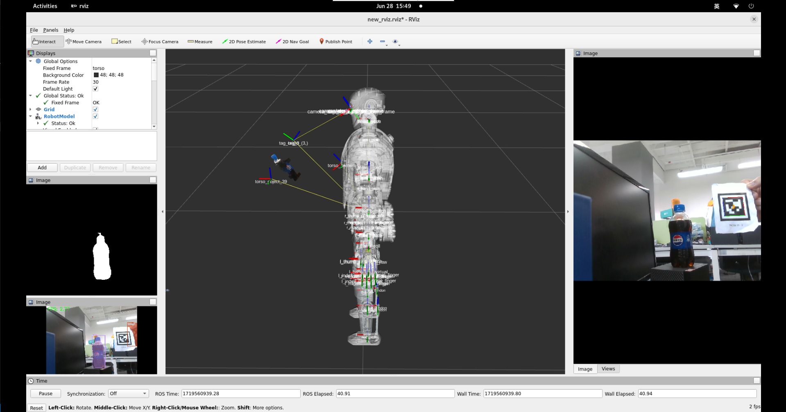
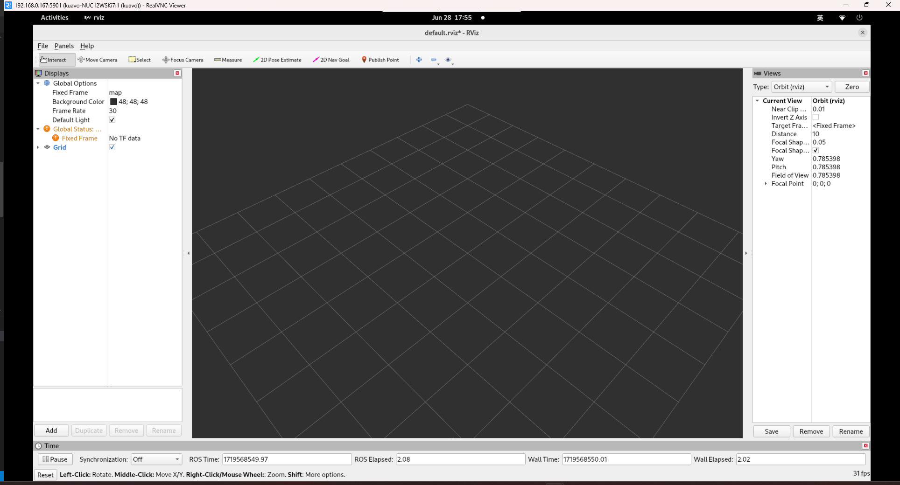
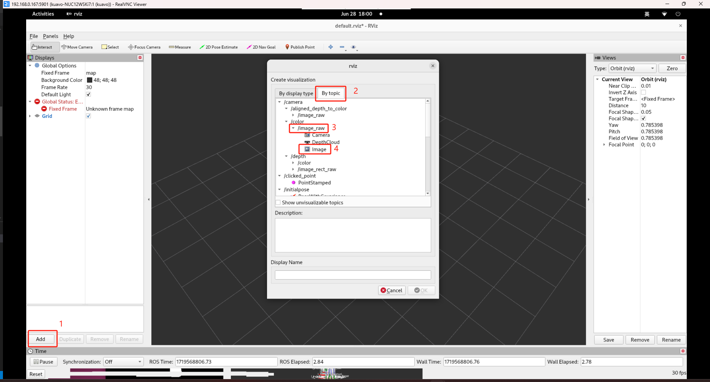
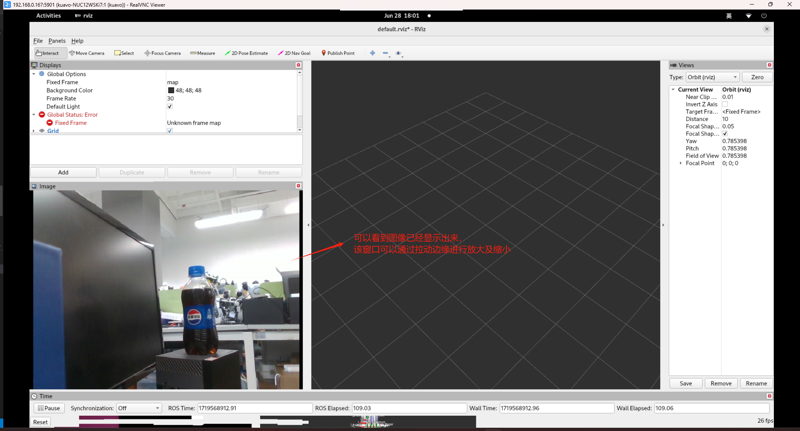
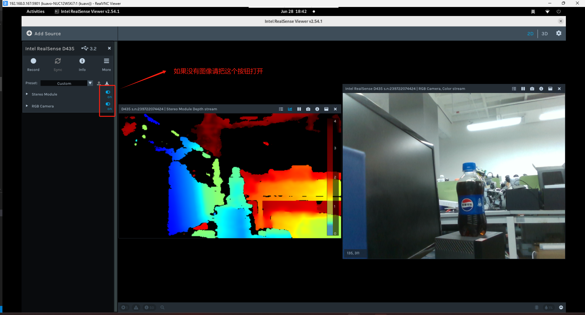
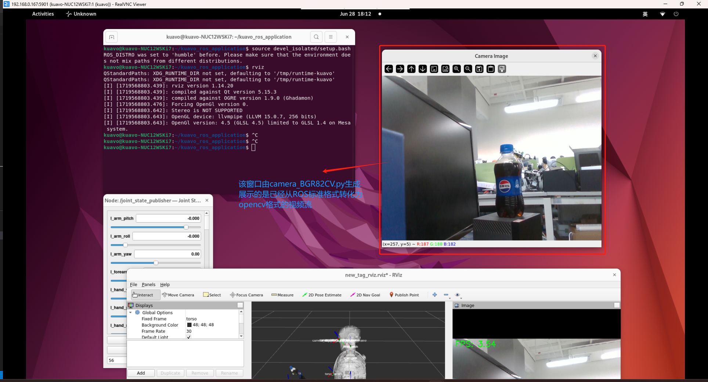

# Kuavo 上位机基础视觉使用手册
## 关于上位机的基础视觉摄像头视频流
```bash
* 基础视频流
* AprilTag识别及转换到机器人基坐标系
* Yolov5目标识别推理及点云分割
```


### 一、基础视觉数据流，通过src/ros_realsense文件夹下的功能包实现，将camera的摄像头流发布到ROS流当中
#### 目前基础视觉流有如下全部信息, 包含了订阅者和发布者的信息及ROS标准数据类型
```bash
 * /camera/realsense2_camera_manager/bond [bond/Status] 2 publishers
 * /camera/stereo_module/parameter_descriptions [dynamic_reconfigure/ConfigDescription] 1 publisher
 * /camera/stereo_module/parameter_updates [dynamic_reconfigure/Config] 1 publisher
 * /camera/rgb_camera/parameter_descriptions [dynamic_reconfigure/ConfigDescription] 1 publisher
 * /camera/rgb_camera/parameter_updates [dynamic_reconfigure/Config] 1 publisher
 * /camera/align_to_color/parameter_descriptions [dynamic_reconfigure/ConfigDescription] 1 publisher
 * /camera/align_to_color/parameter_updates [dynamic_reconfigure/Config] 1 publisher
 * /camera/pointcloud/parameter_descriptions [dynamic_reconfigure/ConfigDescription] 1 publisher
 * /camera/pointcloud/parameter_updates [dynamic_reconfigure/Config] 1 publisher
 * /camera/depth/image_rect_raw [sensor_msgs/Image] 1 publisher
 * /camera/depth/camera_info [sensor_msgs/CameraInfo] 1 publisher
 * /camera/depth/metadata [realsense2_camera/Metadata] 1 publisher
 * /camera/depth/color/points [sensor_msgs/PointCloud2] 1 publisher
 * /camera/color/image_raw [sensor_msgs/Image] 1 publisher
 * /camera/color/camera_info [sensor_msgs/CameraInfo] 1 publisher
 * /camera/color/metadata [realsense2_camera/Metadata] 1 publisher
 * /camera/aligned_depth_to_color/image_raw [sensor_msgs/Image] 1 publisher
 * /camera/aligned_depth_to_color/camera_info [sensor_msgs/CameraInfo] 1 publisher
 * /camera/extrinsics/depth_to_color [realsense2_camera/Extrinsics] 1 publisher
 * /camera/stereo_module/auto_exposure_roi/parameter_descriptions [dynamic_reconfigure/ConfigDescription] 1 publisher
 * /camera/stereo_module/auto_exposure_roi/parameter_updates [dynamic_reconfigure/Config] 1 publisher
 * /camera/rgb_camera/auto_exposure_roi/parameter_descriptions [dynamic_reconfigure/ConfigDescription] 1 publisher
 * /camera/rgb_camera/auto_exposure_roi/parameter_updates [dynamic_reconfigure/Config] 1 publisher
 * /camera/color/image_raw [sensor_msgs/Image] 2 subscribers
 * /camera/color/camera_info [sensor_msgs/CameraInfo] 3 subscribers
 * /camera/depth/color/points [sensor_msgs/PointCloud2] 1 subscriber
 * /camera/depth/image_rect_raw [sensor_msgs/Image] 1 subscriber
 * /camera/realsense2_camera_manager/bond [bond/Status] 2 subscribers
```
#### 重点介绍如下摄像机视频流
```bash
深度相机
* /camera/depth/image_rect_raw # 深度相机图像
* /camera/depth/camera_info    # 深度相机内参（由realsense出厂前设置标定好）
* /camera/depth/color/points   # 带有深度的RGB点云（Point2D）

RGB相机
* /camera/color/image_raw    # RGB相机图像
* /camera/color/camera_info  # RGB相机内参（由realsense出厂前设置标定好）

深度对齐RGB相机
* /camera/aligned_depth_to_color/image_raw   # 深度对齐RGB后的深度图像
* /camera/aligned_depth_to_color/camera_info # 深度对齐RGB后的相机内参
```

#### 1、快速启动可视化教程 & 手动启动可视化教程
##### 头部NUC上位机里面包含了VNC-Server的服务，你可以通过VNC-Viewer进行远程桌面访问，访问的地址为`nuc目前的ip地址:5901`
```bash
# 当开机一键启动的时候 你会看到如下rviz会被自动启动打开，同时显示在你的远程桌面5901的端口上
roslaunch dynamic_biped sensor_robot_enable.launch 
```


#### 2、当然你也可以手动启动摄像头可视化
##### （1）第一步打开rviz（确保roscore是正常启动的）
```bash
cd ~/kuavo_ros_application/
rviz
```

##### （2）第二步，点击下面的ADD按钮，添加你想要数据的可视化



#### 3、打开视频流还有一种方法，通过realsense官方工具，但是请确保相机没有被ROS占用
```bash
# 打开终端
source /opt/ros/humble/setup.bash
realsense-viewer
```


#### 我该如何使用视频流做二次开发？
* 可以通过ros流订阅基础视频流数据进行二次开发
* 或者可以参考基础案例进行视频流转换到opencv里面
```bash
cd /home/kuavo/kuavo_ros_application/src/dynamic_biped/examples/02_use_camera
python3 camera_BGR82CV.py 
```


### 二、AprilTag识别及转换到机器人基坐标系
* AprilTag数据流及可操作的数据如下
```bash
# apriltag_ros/AprilTagDetectionArray 数据格式及内容如下
std_msgs/Header header
AprilTagDetection[] detections

# apriltag_ros/AprilTagDetection 数据格式及内容如下
## Tag ID(s). If a standalone tag, this is a vector of size 1. If a tag bundle,
int32[] id
## Tag size(s). If a standalone tag, this is a vector of size 1. If a tag bundle,
float64[] size
## Pose in the camera frame, obtained from homography transform. If a standalone
geometry_msgs/PoseWithCovarianceStamped pose

```
* AprilTag的数据流ROS topic话题如下：
```bash
 * /tag_detections [apriltag_ros/AprilTagDetectionArray] 1 publisher  # AprilTag识别出来的数据（基于相机坐标系）
 * /tag_detections_image [sensor_msgs/Image] 1 publisher              # AprilTag识别的图像

 * /robot_tag_info [apriltag_ros/AprilTagDetectionArray] 1 publisher  # 经过TF转换后在机器人基base_link坐标系下的tag码数据
```

### 三、Yolov5目标识别推理及点云分割
* 请注意，当前yolov5的数据流识别结果虽然在/object_yolo_segment_image图像当中是对80个类别进行全输出，但实际后处理放入到ROS流当中输出的由config/yolo.yaml决定
#### 关于识别特定的目标，可以查看以下文件(/home/kuavo/kuavo_ros_application/src/ros_vision/detection_yolo/kuavo_vision_object/config/yolo.yaml)查看当前yolo对哪些物体进行了识别和输出结果
```yaml
这个案例就是yolo只会对当前画面下的符合为bottle的物体进行数据处理
# config/yolo.yaml
interested_classes:
  - 39  # 类别ID，39 - bottle

这个案例就是yolo只会对当前画面下的符合为bottle、person、mouse、keyboard的物体进行数据处理
# config/yolo.yaml
interested_classes:
  - 0   # 类别ID，0  - person
  - 39  # 类别ID，39 - bottle
  - 64  # 类别id，64 - mouse 鼠标
  - 66  # 类别ID，66 - keyboard
```
#### 数据流ROS格式如下
```bash
 * /object_yolo_segment_result [vision_msgs/Detection2DArray]  # yolov5目标检测+分割过后的目标数据结果(基于相机坐标系)
 * /object_yolo_segment_image  [sensor_msgs/Image]             # yolov5目标检测+分割过后的目标结果的RGB图像
 * /object_yolo_segment_mask   [sensor_msgs/Image]             # yolov5实例分割的mask模板灰度图（物体所占像素值范围）

 * /object_yolo_tf2_torso_result [vision_msgs/Detection2DArray] # 经过TF转换后在机器人基base_link坐标系下的目标数据结果

 * /segmented_object_cloud [sensor_msgs/PointCloud2]            # 通过 感兴趣目标 所占像素值范围进行的特定点云分割
```