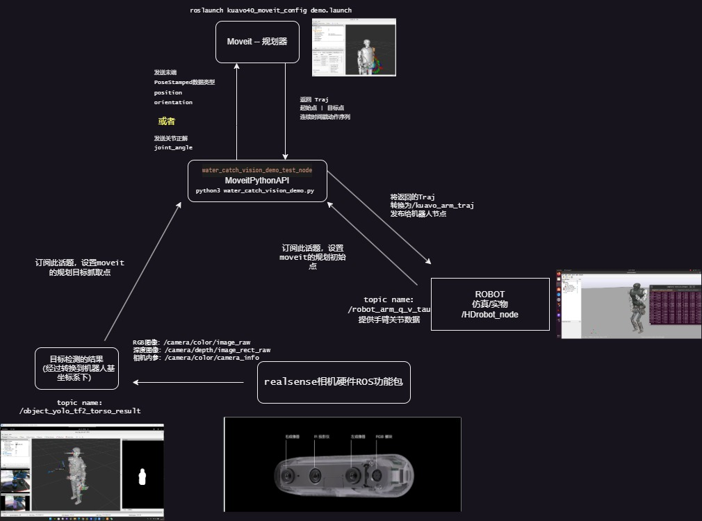
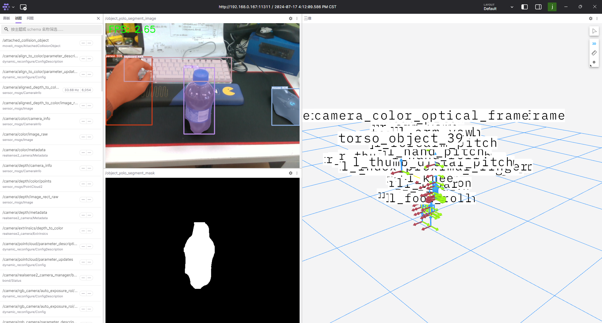
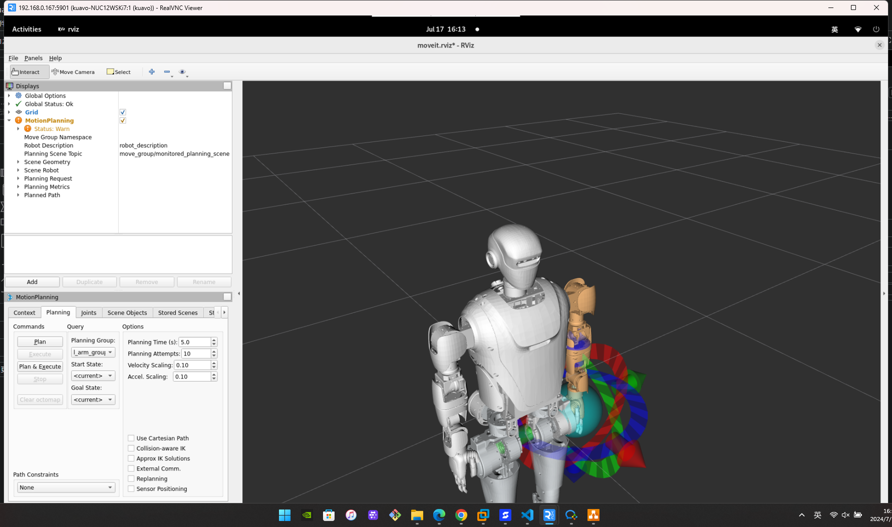
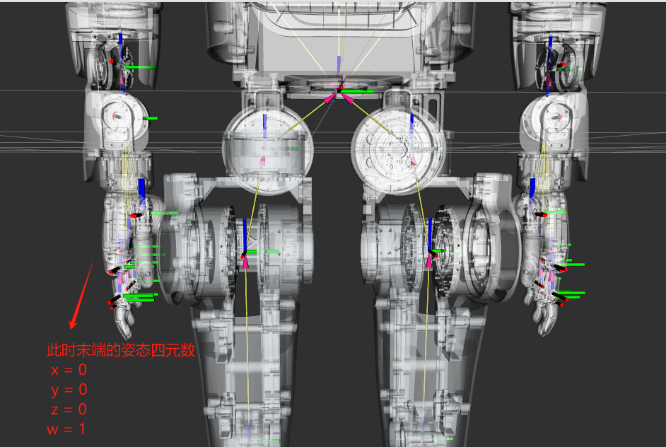
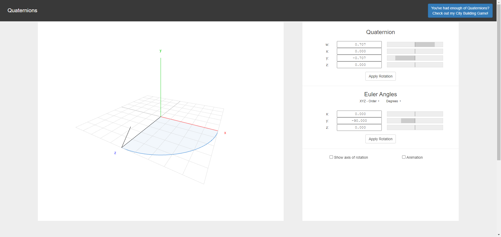
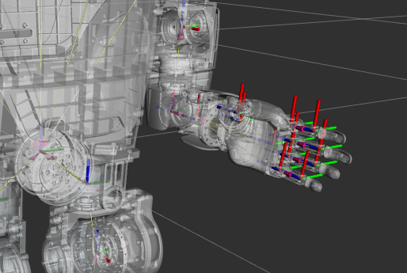
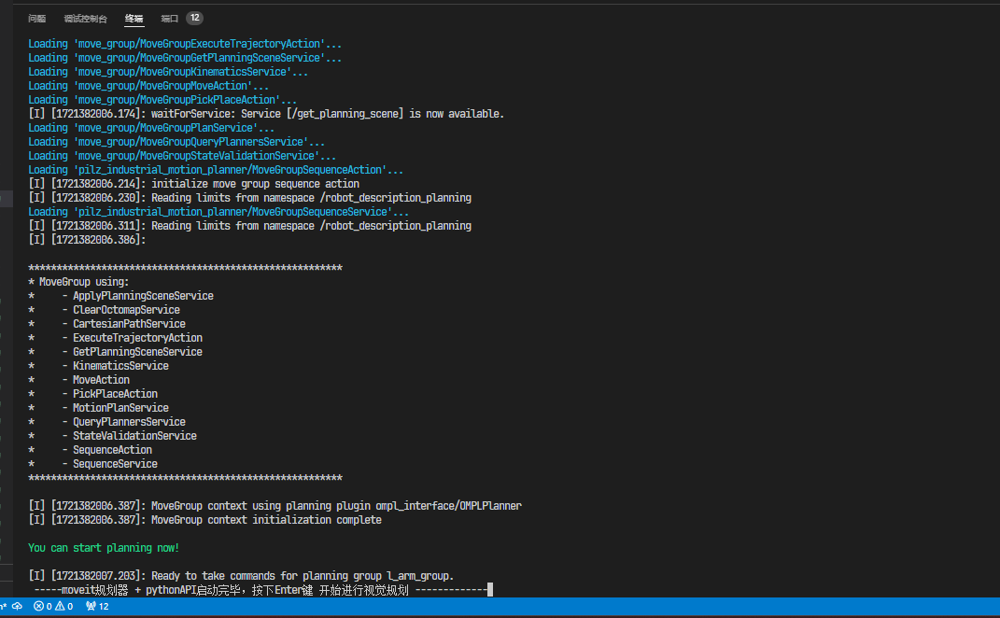

# Kuavo 上位机视觉抓取操作手册
* 具体的 ROS传递 | 调用流程图如下


## 抓取代码MoveitPythonAPI代码流程讲解
1. **初始化和导入模块**：
   - 首先，程序初始化了ROS节点并导入了所需的Python模块和库，包括ROS的相关库（如rospy、moveit_commander）、数学计算库（如math、numpy）、姿态转换库（如tf）、消息类型（如PoseStamped、JointState）、以及自定义的规划、记录、发布和执行功能模块。

2. **定义固定的关节点**：
   - 程序定义了几个预设的关节角度点，用于机器人执行固定轨迹和抓取动作。这些关节角度点以弧度表示，并被用于后续的运动规划和执行。

3. **ROS节点初始化和设置**：
   - 程序初始化了ROS节点，并使用`moveit_commander.roscpp_initialize(sys.argv)`初始化MoveIt库。接着，创建了用于规划、记录、发布和执行的对象实例，并定义了一些全局变量和标志，用于控制程序的执行流程和状态。

4. **检测回调函数（detection_callback）**：
   - 这个回调函数订阅了名为`/object_yolo_tf2_torso_result`的检测结果消息（Detection2DArray类型）。当收到消息时，它首先检查是否有检测结果，如果没有则发出警告并退出。如果有检测结果，它遍历所有的检测结果，找到ID为39的目标。
   - 如果找到了ID为39的目标，就提取其位置信息，并将其转换为机器人可规划的目标姿态（PoseStamped类型）。接着，使用当前关节状态进行运动规划（planner.plan_to_target_pose）。

5. **运动规划和执行**：
   - 如果成功规划出轨迹（traj），则发布轨迹以执行抓取动作。如果规划失败，将根据失败计数器决定是否停止自动发布。
   - 如果连续规划失败超过一定次数，程序将关闭轨迹发布器，防止轨迹发布器消费者线程调用异常
   - 当全局重规划次数到达（MAX_TRAJECTORY_COUNT-1）次时，此时意味着手臂已经靠近到了抓取点，然后接下来执行抓取
   - 抓取完毕后，通过固定的关节轨迹回到初始点

6. **关节状态回调函数（joint_callback）**：
   - 这个回调函数订阅了机器人的关节状态消息（JointState类型），并提取左右手臂的关节角度信息，更新全局变量`joint_state`。

7. **主程序**：
   - 主程序开始时，执行一系列固定点的运动规划和执行动作，以确保机器人来到预备抓水的位置（完成桌子的避障过程）。
   ```python
    Point_zero = angle_to_rad([0, 0, 0, 0, 0, 0, 0])
    Point_1 = angle_to_rad([ 20, 50, 0,   0, 10,   0, 0])
    Point_2 = angle_to_rad([ 30, 90, 0, -50, 90, -30, 0])
    Point_3 = angle_to_rad([-15, 90, 0, -50, 45, -40, 0])
    Point_4 = angle_to_rad([-50, 50, 0, -30,  0, -50, 0])
    Point_5 = angle_to_rad([-50,  0, 0, -30,  0, -50, 0])
   ```
   - 然后，注册订阅了检测和关节状态的消息话题，用于视觉目标的抓取规划及设置规划的初始点
   - 设置了一个主循环来处理所有的ROS回调。

8. **程序执行和结束**：
   - 在主循环中，程序等待直到收到关闭ROS节点的信号。只有视觉检测目标重规划2次之后，才会由detection_callback函数发布signal_shutdown关闭节点的信号

## 抓取特性 -- 视觉检测
* 关于视觉识别，通过onnxruntime推理加速yolov5s-seg模型进行目标推理
* 推理结果为像素坐标系下的目标位置boudingbox + mask图像掩模
* 将像素坐标系下的目标中心位置 + 结合realsense深度相机的RGB图像/深度图像/相机内参，将其转换至相机坐标系
* 通过机器人TF树，将相机坐标系下的目标检测结果转换至机器人基世界坐标系下


## 抓取特性 -- 末端规划
* 监听机器人实物/仿真提供的话题/robot_arm_q_v_tau,不断刷新自身的规划初始点
* 监听目标检测的结果（基于机器人基坐标系），同时将其作为末端规划抓取点（结束点）
* MoveitPythonAPI案例代码向moveit规划服务器不断请求末端目标点规划，如果成功接收Traj，并且通过发布器发布给机器人节点（仿真/实物）
* 重规划冗余两次后，此时手臂已经到达了抓取的实际位置，此时调取灵巧手的接口抓取物体


## 抓取代码工作目录解析
* 来到对应的工作空间目录
```bash
cd /home/kuavo/kuavo_ros_application/src/ros_plan/moveit_interface_plan/scripts
```
* 文件目录如下
```bash
├── config    # moveit配置文件夹
├── example   # 演示案例文件夹，具体使用请看里面的readme
├── traj      # 轨迹存放文件夹
├── __init__.py  # 初始化 
├── base.py      # 控制基础类
├── calibrator.py  # 校准器 
├── exception.py   # 异常类 
├── executor.py    # 执行器 
├── logger.py      # 日志类 
├── optimizer.py   # 优化器 
├── planner.py     # 规划器 
├── publisher.py   # 发布器 
├── scene.py       # 场景类 
├── transformer.py # 变换器 
├── utils.py       # 工具类 
├── README.md      # 启动文档
└── water_catch_vision_demo.py  # MoveitPython视觉抓取水案例python代码
```
## 重点配置文件讲解
### （1）moveitPythonAPI的配置文件 config
* moveit配置文件如下：`/home/kuavo/kuavo_ros_application/src/ros_plan/moveit_interface_plan/scripts/config`
* 在下面重点关于num_planning（当num_planning为3，意味着在一次成功规划发布之前，要进行3次规划方差比较，选取方差最小的一条）
* 然后就是关于容忍度，容忍度决定了允许机器人末端最终到达位置与实际物体位置的误差，提高容忍度很大程度下更容易成功（末端的可达工作空间更容易规划出来解）
```json
{
    "move_group_name"           :"l_arm_group",  // 规划组
    "gripper_name"              :"l_hand_eff",   // 末端抓取的名称
    "joint_name"                :["l_arm_pitch", "l_arm_roll", "l_arm_yaw", "l_forearm_pitch", "l_hand_yaw", "l_hand_pitch", "l_hand_roll"],

    "planner_id"                :"RRTstar",      // RRT规划算法
    "num_planning"              :3,              // 一次规划里的重规划次数（3次规划后进行优化，选取方差最小的输出轨迹）
    "planning_time"             :0.2,            // 规划时间 
    "planning_frame"            :"base_link",    // 规划的frame

    "max_vel_scaling_factor"    :1,              // 速度缩放因子
    "max_acc_scaling_factor"    :1,              // 加速度缩放因子

    "joint_tolerance"           :0.1,            // 关节容忍度（关节误差）单位m -- 目前为10cm
    "orientation_tolerance"     :0.1,            // 姿态容忍度 单位m -- 目前为10cm
    "position_tolerance"        :0.1,            // 位置容忍度 单位m -- 目前为10cm
    
    "publish_rate"              :10,             // 发布速率 
    "gripper_motion_time"       :1               
}
```
### （2）抓取固定姿态（灵巧手抓取姿态）
#### 在water_catch_vision_demo.py代码当中，目标检测获取到的物体话题/object_yolo_tf2_torso_result具有3d的pose（位置），同时orientation（姿态）是默认标准四元数
#### 但是实际抓取的时候如果是标准四元数时候，末端灵巧手的抓取姿态如同下图般，此时你会看到末端是竖着抓取
* 四元数为标准四元数时，抓取姿态的位置
* 
#### 所以为了能够在抓取的时候更容易抓取bottle，我们需要将末端抓取姿态稍微做下处理
* 关于四元数（欧拉角）的可视化，可参考如下网站：[四元数（欧拉角）的可视化](https://quaternions.online/)
* 
* 我们需要针对灵巧手，绕y轴顺时针旋转大约90度，从而能够像平常人类抓取瓶子般抓取物体
* 
* 四元数表示如下
```python
target_pose_stamped.pose.orientation.x = -0.0005388071066334781
target_pose_stamped.pose.orientation.y = -0.7904212674887817
target_pose_stamped.pose.orientation.z = 0.00032694187655405566
target_pose_stamped.pose.orientation.w = 0.6125633213777487
```

### （3）目标检测节点yolo_detection_node配置感兴趣的识别目标
#### 配置文件路径：`/home/kuavo/kuavo_ros_application/src/ros_vision/detection_yolo/kuavo_vision_object/config`
```yaml
# config/yolo.yaml
interested_classes: # 此时yolo节点会输出识别结果为bottle的结果到ros流中
  - 39  # 类别ID，39 - bottle

```
* 该配置文件的作用是对yolo5seg的检测分割结果进行后处理，只针对感兴趣的（特定的）识别目标进行输出到ROS流当中
* 目前视觉抓取水，只将id=39（瓶子）放入到配置当中，让yolo节点只输出关于瓶子的boundingbox + mask
* 如果想添加其他物品，可以将上述的id放入到`interested_classes`下即可
```yaml
# config/yolo.yaml
interested_classes: # 此时yolo会输出识别结果为bottle和keyboard键盘的结果到ROS流中
  - 39  # 类别ID，39 - bottle
  - 66  # 类别ID，66 - keyboard
```

## 启动命令
### （重点）在启动视觉抓取案例前，请确保以下在上位机内部有如下launch文件是已经打开的
* （1）上位机传感器launch文件 ： 上位机启动了sensor_robot_enable.launch文件
```bash
cd ~/kuavo_ros_application
roslaunch dynamic_biped sensor_robot_enable.launch 
```
### （重点）在启动视觉抓取案例前，如果想看到抓取的效果，需要在下位机NUC启动机器人节点
* （1）开启机器人节点
```bash
cd ~/kuavo_ros_ws       # Navigate to the source space
source devel/setup.bash # Source your ROS distro

# 下述机器人启动方式 二选一
rosrun dynamic_biped highlyDynamicRobot_node --real --log_lcm # 机器人实物
roslaunch dynamic_biped highly_dynamic_robot.launch # 机器人仿真
```

### 启动视觉抓取 -- watch catch 视觉抓取水
* 启动指南如下：（等待过程有些久，启动moveit服务器大概在20秒左右）
```bash
cd ~/kuavo_ros_application/
source ~/kuavo_ros_application/devel/setup.bash
roslaunch moveit_interface_plan vision_catch_water_demo.launch # 启动moveit规划器 + moveitPythonAPI视觉抓水案例
```
* 等待`---moveit规划器+pythonAPI启动完毕，按下Enter键 开始进行视觉规划----`的字样出现时，按下enter键即可开始视觉抓取水瓶bottle
* 
