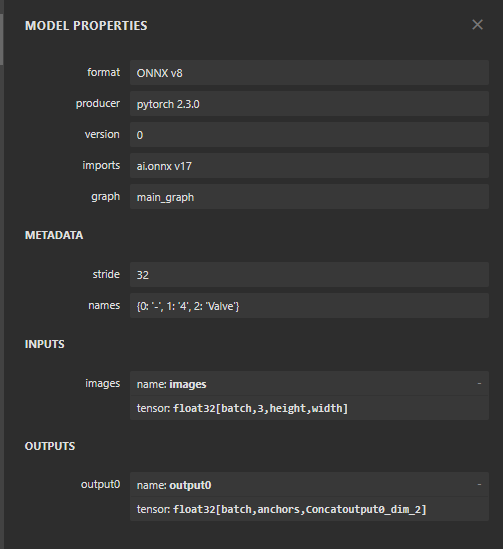
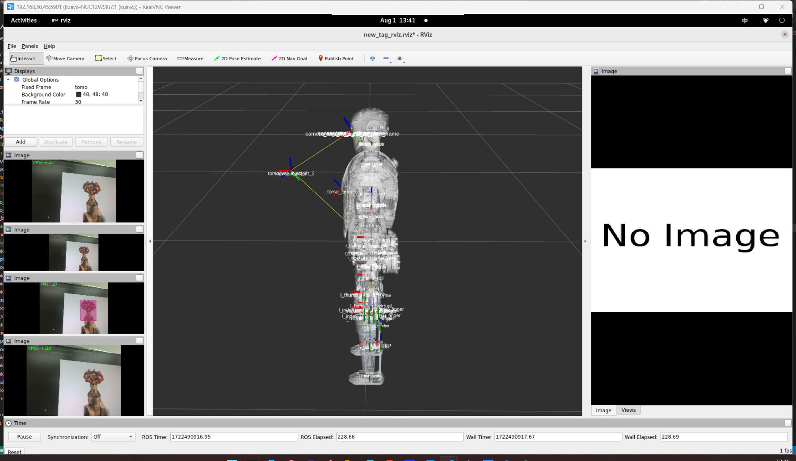
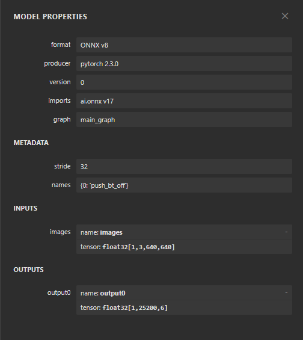
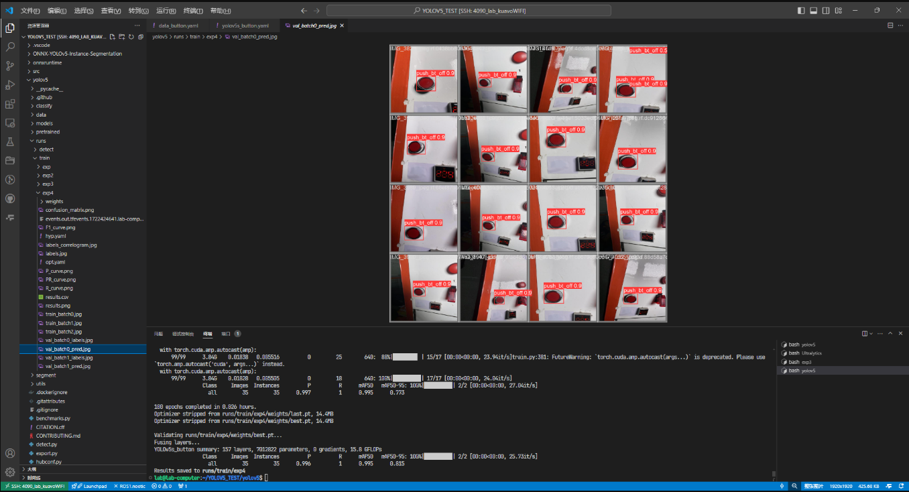

# 阀门按钮识别使用手册
## 针对于2024人工智能打机器人比赛 -- 比赛任务（视觉感知阀门及按钮识别使用）
* yolo_button_object_detection -- 按钮识别yoloROS功能包
* yolo_valve_object_detection -- 阀门识别yoloROS功能包

## 阀门识别具体的仓库可查看
* `/home/kuavo/kuavo_ros_application/src/ros_vision/detection_industrial_yolo/yolo_valve_object_detection`
* 阀门识别 yolo5s_forValve.onnx 模型格式
* 
* 

## 按钮识别具体的仓库可查看
* `/home/kuavo/kuavo_ros_application/src/ros_vision/detection_industrial_yolo/yolo_button_object_detection`
* 按钮识别 yolo5s_forButton.onnx 模型格式
* 
* 

## 阀门识别 ros流话题订阅
```bash
/object_yolo_valve_segment_result 【基于相机坐标系下的阀门的3D pose】
/object_yolo_valve_segment_image  【识别阀门的绘制结果】

/object_yolo_valve_tf2_torso_result 【基于机器人基坐标系下的阀门的3D pose】
```

## 按钮识别 ros流话题订阅
```bash
/object_yolo_button_segment_result  【基于相机坐标系下的按钮的3D pose】
/object_yolo_button_segment_image   【识别按钮的绘制结果】

/object_yolo_button_tf2_torso_result 【基于机器人基坐标系下的按钮的3D pose】
```

## 关于启动，一键使用launch启动
```bash
cd ~/kuavo_ros_application # 去到对应的目录

catkin build # 编译

roslaunch yolo_button_object_detection one_start_valve_button_yolo.launch  # 一键启动阀门识别+按钮识别的launch

roslaunch yolo_button_object_detection yolo_segment_detect.launch # 只启动按钮识别的launch
roslaunch yolo_valve_object_detection yolo_segment_detect.launch  # 只启动阀门识别的launch 
```